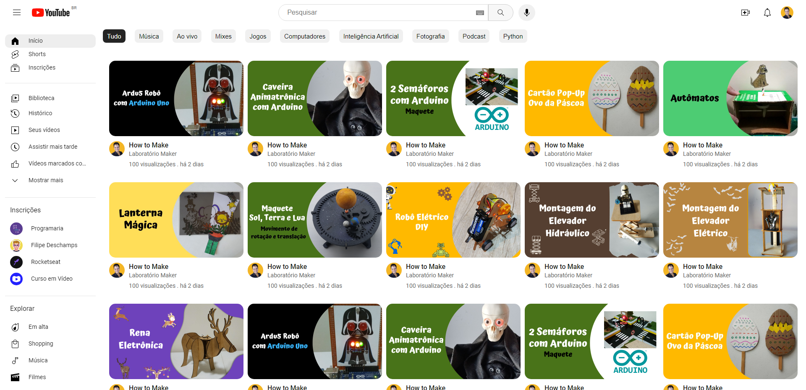
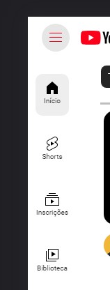
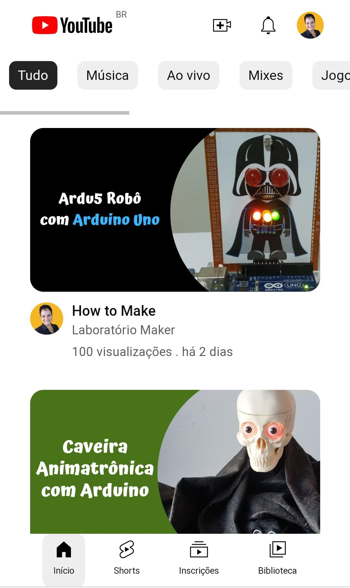
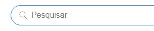
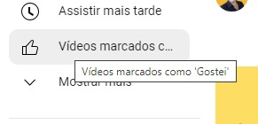

## 🚀 Tecnologias

Esse projeto foi desenvolvido com as seguintes tecnologias:

- HTML, CSS e JavaScript
- Git e Github

## 💻 Projeto

É uma cópia da interface principal do YouTube.

- [Visite o projeto online](https://)

## 🔖 Layout

  
   Desktop: 

  

  
   Menu fechado: 

  

  
   Mobile: 

  

  
   Barra de pesquisa selecionada: 
  
    
    
  
   Detalhe do Tooltip: 
  
  

## :memo: Licença

Esse projeto está sob a licença MIT.
